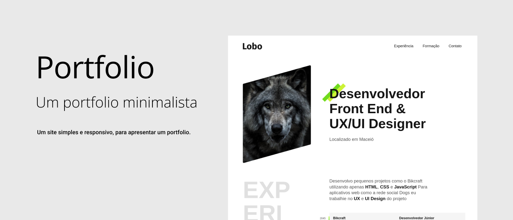

# Portfolio
Um site simples e responsivo, para apresentar um portfolio.

**AVISO:** Se trata de um portfolio ficticio meramente ilustrativo, para fins de estudo.

Esse projeto foi desenvolvido durante os cursos, "UI Design para iniciantes" e "HTML e CSS para iniciantes" todos da Origamid.

### Indece
- [Links](#links)
- [Tecnologias](#tecnologias)
- [Autor](#autor)

### Links
- Site: https://jonathan-matheus.github.io/portfolio/
- Curso: https://www.origamid.com/

#### Tecnologias
- HTML e CSS

#### Autor

**Autor:** Jonathan Matheus Da Silva 

 
 

